Chase’s wheat project
================
Riley M. Anderson & Chase Baerlocher
March 18, 2026

  

- [Overview](#overview)
- [Shoot weight](#shoot-weight)
  - [Predicted values from shoot weight
    model:](#predicted-values-from-shoot-weight-model)
- [Root Weight](#root-weight)
  - [Predicted values from root weight
    model:](#predicted-values-from-root-weight-model)
- [Aphid nymphs](#aphid-nymphs)
  - [Predicted values from nymph model
    (glm):](#predicted-values-from-nymph-model-glm)
- [Nodules](#nodules)
  - [Predicted values for nodules
    (glm):](#predicted-values-for-nodules-glm)
- [Contrasts](#contrasts)
  - [Shoot weight contrasts](#shoot-weight-contrasts)
  - [Root weight contrasts](#root-weight-contrasts)
  - [Nymph contrasts](#nymph-contrasts)
- [Session Information](#session-information)

## Overview

What is this analysis about?

## Shoot weight

    Levene's Test for Homogeneity of Variance (center = median)
           Df F value  Pr(>F)  
    group  35  1.4522 0.06153 .
          180                  
    ---
    Signif. codes:  0 '***' 0.001 '**' 0.01 '*' 0.05 '.' 0.1 ' ' 1
    Analysis of Variance Table

    Response: sw
                  Df  Sum Sq Mean Sq  F value    Pr(>F)    
    var            5  6.2336  1.2467  14.5358 5.833e-12 ***
    aph            2  0.3368  0.1684   1.9632   0.14341    
    rhiz           1 10.2704 10.2704 119.7458 < 2.2e-16 ***
    var:aph       10  1.6155  0.1615   1.8835   0.05001 .  
    var:rhiz       5  2.7065  0.5413   6.3112 2.012e-05 ***
    aph:rhiz       2  0.2558  0.1279   1.4914   0.22782    
    var:aph:rhiz  10  0.9264  0.0926   1.0801   0.37974    
    Residuals    180 15.4383  0.0858                       
    ---
    Signif. codes:  0 '***' 0.001 '**' 0.01 '*' 0.05 '.' 0.1 ' ' 1
    Analysis of Variance Table

    Model 1: sw ~ var * aph * rhiz
    Model 2: sw ~ var + aph + rhiz + var:aph + var:rhiz + aph:rhiz
      Res.Df    RSS  Df Sum of Sq Pr(>Chi)
    1    180 15.438                       
    2    190 16.365 -10  -0.92639   0.3732

        Shapiro-Wilk normality test

    data:  residuals(sw.lm)
    W = 0.98541, p-value = 0.02553

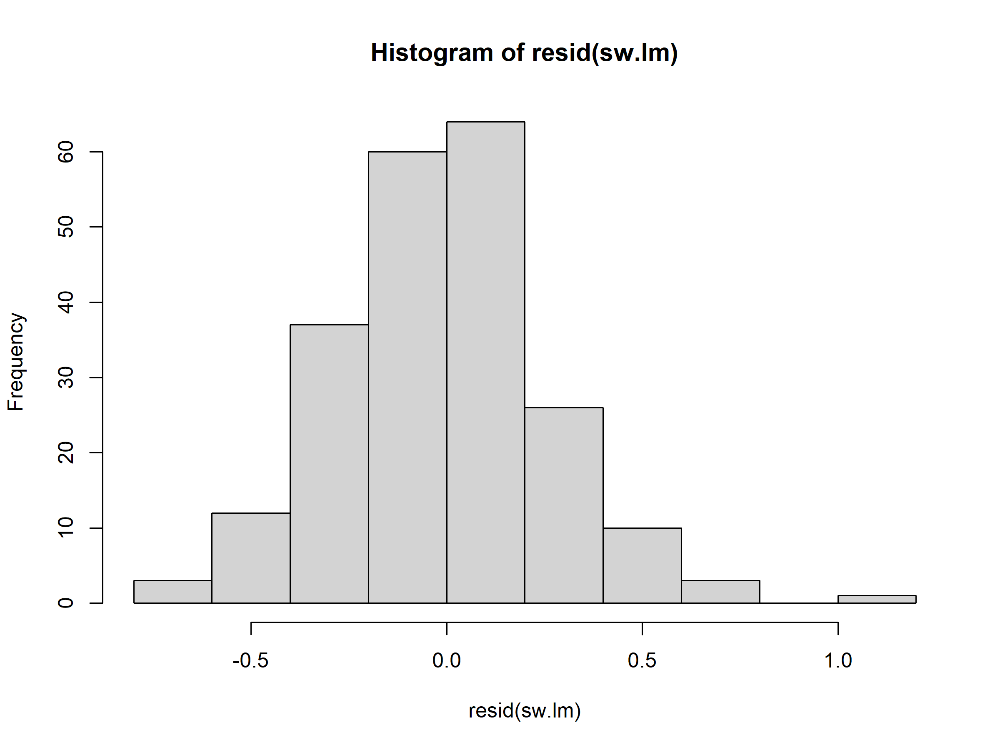<!-- -->

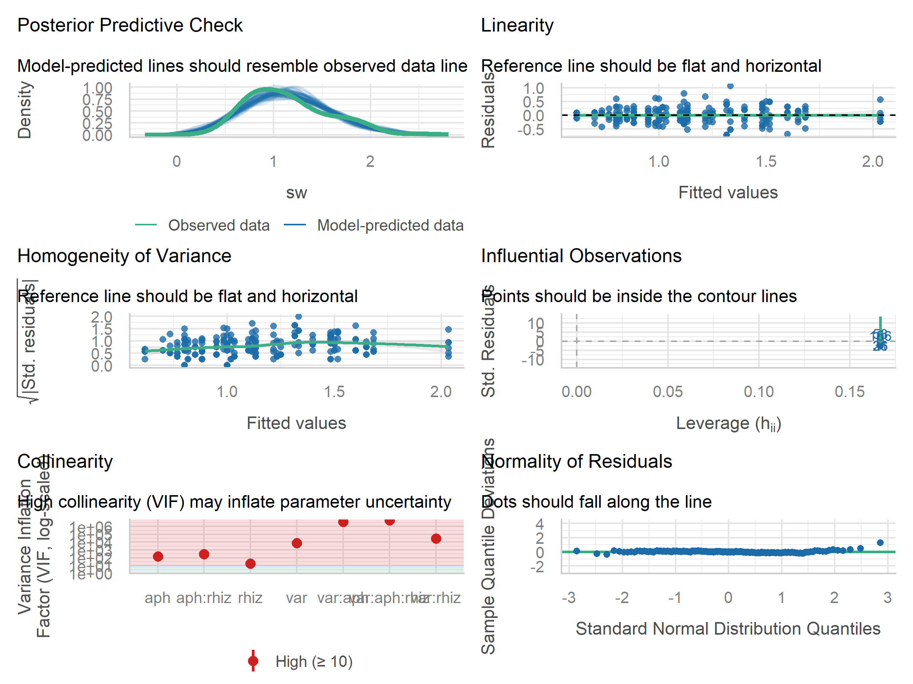<!-- -->

    ## 
    ## Call:
    ## lm(formula = sw ~ var * aph * rhiz, data = pb)
    ## 
    ## Residuals:
    ##     Min      1Q  Median      3Q     Max 
    ## -0.7167 -0.1500  0.0000  0.1500  1.0667 
    ## 
    ## Coefficients:
    ##                               Estimate Std. Error t value Pr(>|t|)    
    ## (Intercept)                  1.517e+00  1.196e-01  12.685  < 2e-16 ***
    ## varWindham                  -2.667e-01  1.691e-01  -1.577 0.116523    
    ## varLynx                     -5.667e-01  1.691e-01  -3.351 0.000980 ***
    ## varMiCa                     -4.000e-01  1.691e-01  -2.366 0.019060 *  
    ## varDint                      8.333e-02  1.691e-01   0.493 0.622719    
    ## varKlondike                 -2.000e-01  1.691e-01  -1.183 0.238432    
    ## aphPEMV-                     1.333e-01  1.691e-01   0.789 0.431406    
    ## aphPEMV+                    -1.667e-02  1.691e-01  -0.099 0.921589    
    ## rhizNR                      -5.167e-01  1.691e-01  -3.056 0.002587 ** 
    ## varWindham:aphPEMV-         -4.000e-01  2.391e-01  -1.673 0.096106 .  
    ## varLynx:aphPEMV-             5.000e-02  2.391e-01   0.209 0.834608    
    ## varMiCa:aphPEMV-             2.333e-01  2.391e-01   0.976 0.330476    
    ## varDint:aphPEMV-             3.000e-01  2.391e-01   1.255 0.211253    
    ## varKlondike:aphPEMV-         3.333e-02  2.391e-01   0.139 0.889291    
    ## varWindham:aphPEMV+         -1.167e-01  2.391e-01  -0.488 0.626216    
    ## varLynx:aphPEMV+             1.000e-01  2.391e-01   0.418 0.676301    
    ## varMiCa:aphPEMV+             1.167e-01  2.391e-01   0.488 0.626216    
    ## varDint:aphPEMV+             1.000e-01  2.391e-01   0.418 0.676301    
    ## varKlondike:aphPEMV+         1.000e-01  2.391e-01   0.418 0.676301    
    ## varWindham:rhizNR            5.534e-15  2.391e-01   0.000 1.000000    
    ## varLynx:rhizNR               9.000e-01  2.391e-01   3.764 0.000226 ***
    ## varMiCa:rhizNR               2.000e-01  2.391e-01   0.836 0.404041    
    ## varDint:rhizNR              -2.000e-01  2.391e-01  -0.836 0.404041    
    ## varKlondike:rhizNR          -1.000e-01  2.391e-01  -0.418 0.676301    
    ## aphPEMV-:rhizNR             -3.333e-02  2.391e-01  -0.139 0.889291    
    ## aphPEMV+:rhizNR              3.333e-02  2.391e-01   0.139 0.889291    
    ## varWindham:aphPEMV-:rhizNR   1.833e-01  3.382e-01   0.542 0.588395    
    ## varLynx:aphPEMV-:rhizNR     -4.833e-01  3.382e-01  -1.429 0.154661    
    ## varMiCa:aphPEMV-:rhizNR     -1.833e-01  3.382e-01  -0.542 0.588395    
    ## varDint:aphPEMV-:rhizNR     -1.500e-01  3.382e-01  -0.444 0.657889    
    ## varKlondike:aphPEMV-:rhizNR -6.667e-02  3.382e-01  -0.197 0.843940    
    ## varWindham:aphPEMV+:rhizNR   1.833e-01  3.382e-01   0.542 0.588395    
    ## varLynx:aphPEMV+:rhizNR     -6.500e-01  3.382e-01  -1.922 0.056170 .  
    ## varMiCa:aphPEMV+:rhizNR     -8.333e-02  3.382e-01  -0.246 0.805634    
    ## varDint:aphPEMV+:rhizNR      2.333e-01  3.382e-01   0.690 0.491088    
    ## varKlondike:aphPEMV+:rhizNR  6.667e-02  3.382e-01   0.197 0.843940    
    ## ---
    ## Signif. codes:  0 '***' 0.001 '**' 0.01 '*' 0.05 '.' 0.1 ' ' 1
    ## 
    ## Residual standard error: 0.2929 on 180 degrees of freedom
    ## Multiple R-squared:  0.5914, Adjusted R-squared:  0.5119 
    ## F-statistic: 7.444 on 35 and 180 DF,  p-value: < 2.2e-16

    ## 
    ##  Shapiro-Wilk normality test
    ## 
    ## data:  residuals(sw.lm.log)
    ## W = 0.98585, p-value = 0.03002

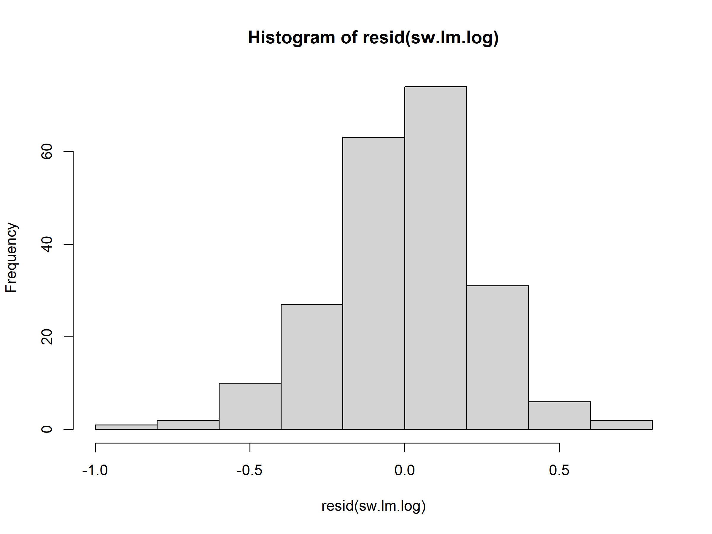<!-- -->

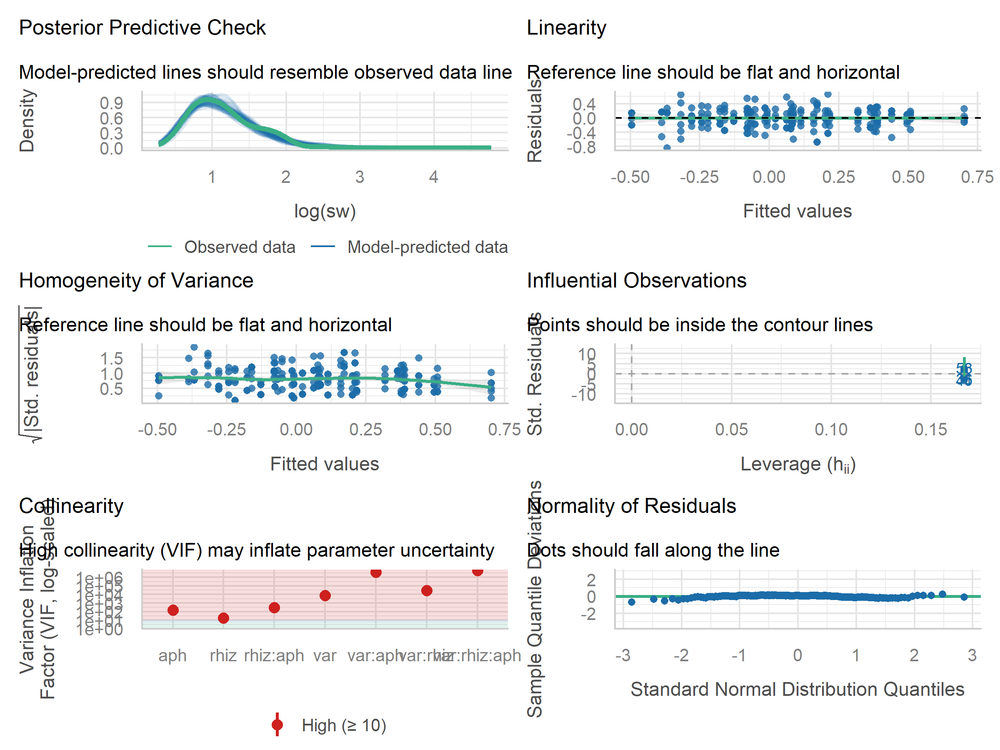<!-- -->

The simple shoot weight lm is fine, but there isn’t a 3-way interaction.
Consider updating your hypothesis.

### Predicted values from shoot weight model:

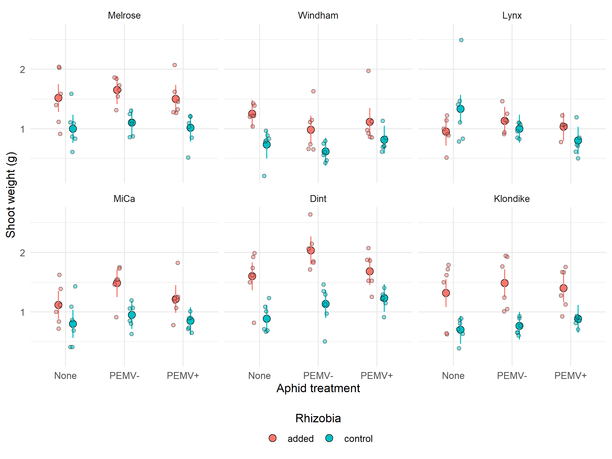<!-- -->

- **Shoot weight by aphid treatment, rhizobia treatment, and wheat
  variety.** Large points are model estimated predicted values, whiskers
  are the 95% confidence interval, small points are the raw data.

## Root Weight

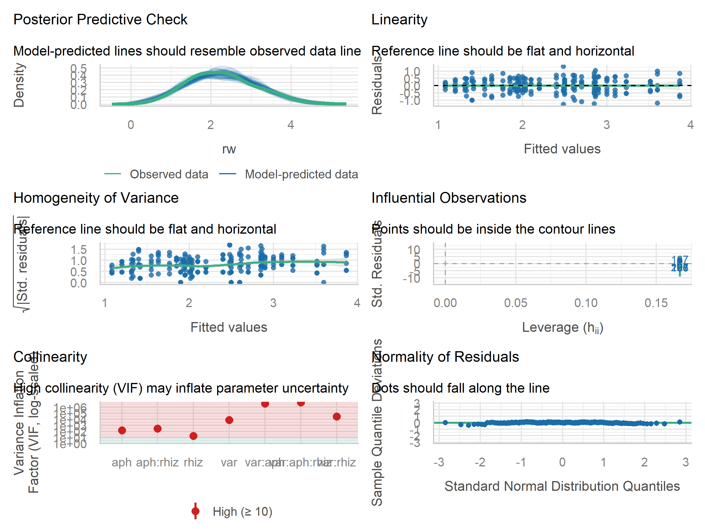<!-- -->

    ## Analysis of Variance Table
    ## 
    ## Response: rw
    ##               Df Sum Sq Mean Sq  F value    Pr(>F)    
    ## var            5  6.024   1.205   4.8108 0.0003747 ***
    ## aph            2 73.037  36.519 145.8316 < 2.2e-16 ***
    ## rhiz           1  1.833   1.833   7.3213 0.0074693 ** 
    ## var:aph       10  8.793   0.879   3.5114 0.0002969 ***
    ## var:rhiz       5  9.817   1.963   7.8405 1.062e-06 ***
    ## aph:rhiz       2  2.552   1.276   5.0950 0.0070408 ** 
    ## var:aph:rhiz  10  5.242   0.524   2.0934 0.0270904 *  
    ## Residuals    180 45.075   0.250                       
    ## ---
    ## Signif. codes:  0 '***' 0.001 '**' 0.01 '*' 0.05 '.' 0.1 ' ' 1
    ## 
    ## Call:
    ## lm(formula = rw ~ var * aph * rhiz, data = pb)
    ## 
    ## Residuals:
    ##    Min     1Q Median     3Q    Max 
    ## -1.283 -0.300  0.000  0.300  1.317 
    ## 
    ## Coefficients:
    ##                             Estimate Std. Error t value Pr(>|t|)    
    ## (Intercept)                  1.55000    0.20429   7.587 1.69e-12 ***
    ## varWindham                  -0.13333    0.28892  -0.461 0.645000    
    ## varLynx                     -0.46667    0.28892  -1.615 0.108011    
    ## varMiCa                     -0.21667    0.28892  -0.750 0.454276    
    ## varDint                     -0.35000    0.28892  -1.211 0.227320    
    ## varKlondike                 -0.15000    0.28892  -0.519 0.604271    
    ## aphPEMV-                     0.45000    0.28892   1.558 0.121097    
    ## aphPEMV+                     1.55000    0.28892   5.365 2.47e-07 ***
    ## rhizNR                       0.48333    0.28892   1.673 0.096080 .  
    ## varWindham:aphPEMV-          0.23333    0.40859   0.571 0.568663    
    ## varLynx:aphPEMV-             0.36667    0.40859   0.897 0.370705    
    ## varMiCa:aphPEMV-             0.83333    0.40859   2.040 0.042858 *  
    ## varDint:aphPEMV-             0.85000    0.40859   2.080 0.038911 *  
    ## varKlondike:aphPEMV-         1.38333    0.40859   3.386 0.000872 ***
    ## varWindham:aphPEMV+         -0.11667    0.40859  -0.286 0.775562    
    ## varLynx:aphPEMV+            -0.68333    0.40859  -1.672 0.096178 .  
    ## varMiCa:aphPEMV+            -0.40000    0.40859  -0.979 0.328904    
    ## varDint:aphPEMV+             0.11667    0.40859   0.286 0.775562    
    ## varKlondike:aphPEMV+         0.91667    0.40859   2.243 0.026084 *  
    ## varWindham:rhizNR            0.05000    0.40859   0.122 0.902740    
    ## varLynx:rhizNR               0.20000    0.40859   0.489 0.625091    
    ## varMiCa:rhizNR               0.03333    0.40859   0.082 0.935070    
    ## varDint:rhizNR              -0.36667    0.40859  -0.897 0.370705    
    ## varKlondike:rhizNR          -0.25000    0.40859  -0.612 0.541401    
    ## aphPEMV-:rhizNR             -0.28333    0.40859  -0.693 0.488925    
    ## aphPEMV+:rhizNR             -0.73333    0.40859  -1.795 0.074364 .  
    ## varWindham:aphPEMV-:rhizNR  -0.33333    0.57783  -0.577 0.564748    
    ## varLynx:aphPEMV-:rhizNR      0.20000    0.57783   0.346 0.729655    
    ## varMiCa:aphPEMV-:rhizNR     -0.15000    0.57783  -0.260 0.795476    
    ## varDint:aphPEMV-:rhizNR      0.06667    0.57783   0.115 0.908277    
    ## varKlondike:aphPEMV-:rhizNR -1.25000    0.57783  -2.163 0.031840 *  
    ## varWindham:aphPEMV+:rhizNR   0.35000    0.57783   0.606 0.545468    
    ## varLynx:aphPEMV+:rhizNR      0.70000    0.57783   1.211 0.227320    
    ## varMiCa:aphPEMV+:rhizNR      1.25000    0.57783   2.163 0.031840 *  
    ## varDint:aphPEMV+:rhizNR      1.35000    0.57783   2.336 0.020575 *  
    ## varKlondike:aphPEMV+:rhizNR -0.46667    0.57783  -0.808 0.420377    
    ## ---
    ## Signif. codes:  0 '***' 0.001 '**' 0.01 '*' 0.05 '.' 0.1 ' ' 1
    ## 
    ## Residual standard error: 0.5004 on 180 degrees of freedom
    ## Multiple R-squared:  0.7042, Adjusted R-squared:  0.6467 
    ## F-statistic: 12.24 on 35 and 180 DF,  p-value: < 2.2e-16

### Predicted values from root weight model:

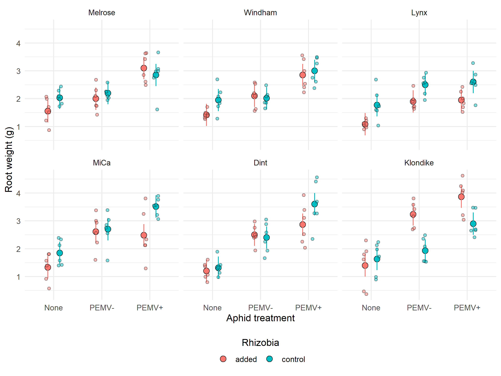<!-- -->

- **Root weight by aphid treatment, rhizobia treatment, and wheat
  variety.** Large points are model estimated predicted values, whiskers
  are the 95% confidence interval, small points are the raw data.

## Aphid nymphs

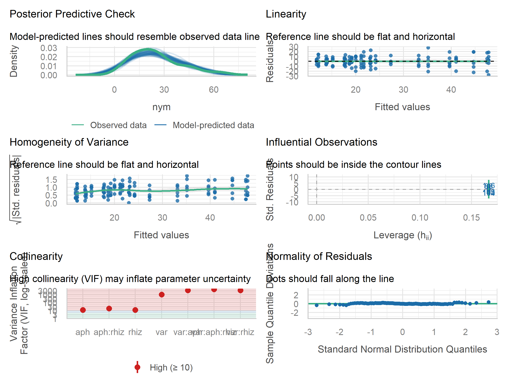<!-- -->

    ## Analysis of Variance Table
    ## 
    ## Response: nym
    ##               Df  Sum Sq Mean Sq F value    Pr(>F)    
    ## var            5  3387.9   677.6  6.4963 2.220e-05 ***
    ## aph            1  6136.1  6136.1 58.8298 5.016e-12 ***
    ## rhiz           1   560.1   560.1  5.3700 0.0221801 *  
    ## var:aph        5  2795.0   559.0  5.3593 0.0001753 ***
    ## var:rhiz       5  2720.8   544.2  5.2171 0.0002276 ***
    ## aph:rhiz       1   373.8   373.8  3.5836 0.0607617 .  
    ## var:aph:rhiz   5  2891.0   578.2  5.5434 0.0001251 ***
    ## Residuals    120 12516.3   104.3                      
    ## ---
    ## Signif. codes:  0 '***' 0.001 '**' 0.01 '*' 0.05 '.' 0.1 ' ' 1
    ## 
    ## Call:
    ## lm(formula = nym ~ var * aph * rhiz, data = nb)
    ## 
    ## Residuals:
    ##      Min       1Q   Median       3Q      Max 
    ## -27.8333  -4.9167  -0.5833   5.3750  27.8333 
    ## 
    ## Coefficients:
    ##                             Estimate Std. Error t value Pr(>|t|)   
    ## (Intercept)                   14.000      4.169   3.358  0.00105 **
    ## varWindham                     5.167      5.896   0.876  0.38265   
    ## varLynx                       -2.167      5.896  -0.367  0.71393   
    ## varMiCa                        7.167      5.896   1.215  0.22659   
    ## varDint                        6.000      5.896   1.018  0.31093   
    ## varKlondike                    9.000      5.896   1.526  0.12955   
    ## aphPEMV+                      -1.833      5.896  -0.311  0.75640   
    ## rhizNR                         3.667      5.896   0.622  0.53522   
    ## varWindham:aphPEMV+           15.833      8.339   1.899  0.06000 . 
    ## varLynx:aphPEMV+              13.167      8.339   1.579  0.11698   
    ## varMiCa:aphPEMV+              -7.167      8.339  -0.859  0.39181   
    ## varDint:aphPEMV+              21.500      8.339   2.578  0.01114 * 
    ## varKlondike:aphPEMV+          26.667      8.339   3.198  0.00177 **
    ## varWindham:rhizNR              4.500      8.339   0.540  0.59044   
    ## varLynx:rhizNR                -1.667      8.339  -0.200  0.84192   
    ## varMiCa:rhizNR                -7.000      8.339  -0.839  0.40289   
    ## varDint:rhizNR                -2.000      8.339  -0.240  0.81086   
    ## varKlondike:rhizNR           -11.500      8.339  -1.379  0.17043   
    ## aphPEMV+:rhizNR                8.333      8.339   0.999  0.31964   
    ## varWindham:aphPEMV+:rhizNR   -14.500     11.793  -1.230  0.22127   
    ## varLynx:aphPEMV+:rhizNR       14.000     11.793   1.187  0.23751   
    ## varMiCa:aphPEMV+:rhizNR       23.833     11.793   2.021  0.04550 * 
    ## varDint:aphPEMV+:rhizNR      -31.000     11.793  -2.629  0.00969 **
    ## varKlondike:aphPEMV+:rhizNR   -3.667     11.793  -0.311  0.75640   
    ## ---
    ## Signif. codes:  0 '***' 0.001 '**' 0.01 '*' 0.05 '.' 0.1 ' ' 1
    ## 
    ## Residual standard error: 10.21 on 120 degrees of freedom
    ## Multiple R-squared:  0.6011, Adjusted R-squared:  0.5247 
    ## F-statistic: 7.864 on 23 and 120 DF,  p-value: 6.129e-15

- diagnostics from a lm on nymph counts are fine, but a count model
  would be more appropriate

<!-- -->

    ##  Family: nbinom2  ( log )
    ## Formula:          nym ~ var * aph * rhiz
    ## Data: nb
    ## 
    ##       AIC       BIC    logLik -2*log(L)  df.resid 
    ##    1098.1    1172.3    -524.1    1048.1       119 
    ## 
    ## 
    ## Dispersion parameter for nbinom2 family ():  8.3 
    ## 
    ## Conditional model:
    ##                             Estimate Std. Error z value Pr(>|z|)    
    ## (Intercept)                  2.63906    0.17884  14.757  < 2e-16 ***
    ## varWindham                   0.31410    0.24648   1.274  0.20254    
    ## varLynx                     -0.16814    0.25718  -0.654  0.51325    
    ## varMiCa                      0.41337    0.24481   1.689  0.09131 .  
    ## varDint                      0.35667    0.24575   1.451  0.14668    
    ## varKlondike                  0.49644    0.24353   2.039  0.04150 *  
    ## aphPEMV+                    -0.14037    0.25643  -0.547  0.58411    
    ## rhizNR                       0.23260    0.24798   0.938  0.34825    
    ## varWindham:aphPEMV+          0.68874    0.34588   1.991  0.04645 *  
    ## varLynx:aphPEMV+             0.81216    0.35664   2.277  0.02277 *  
    ## varMiCa:aphPEMV+            -0.41337    0.35705  -1.158  0.24697    
    ## varDint:aphPEMV+             0.82515    0.34416   2.398  0.01650 *  
    ## varKlondike:aphPEMV+         0.87258    0.34153   2.555  0.01062 *  
    ## varWindham:rhizNR            0.12233    0.34123   0.359  0.71996    
    ## varLynx:rhizNR              -0.07645    0.35746  -0.214  0.83066    
    ## varMiCa:rhizNR              -0.40397    0.34477  -1.172  0.24132    
    ## varDint:rhizNR              -0.15256    0.34304  -0.445  0.65651    
    ## varKlondike:rhizNR          -0.64900    0.34624  -1.874  0.06087 .  
    ## aphPEMV+:rhizNR              0.45366    0.34963   1.298  0.19444    
    ## varWindham:aphPEMV+:rhizNR  -0.75004    0.47656  -1.574  0.11552    
    ## varLynx:aphPEMV+:rhizNR      0.10820    0.48927   0.221  0.82499    
    ## varMiCa:aphPEMV+:rhizNR      0.93258    0.48738   1.913  0.05569 .  
    ## varDint:aphPEMV+:rhizNR     -1.28749    0.48136  -2.675  0.00748 ** 
    ## varKlondike:aphPEMV+:rhizNR -0.10576    0.47750  -0.221  0.82471    
    ## ---
    ## Signif. codes:  0 '***' 0.001 '**' 0.01 '*' 0.05 '.' 0.1 ' ' 1

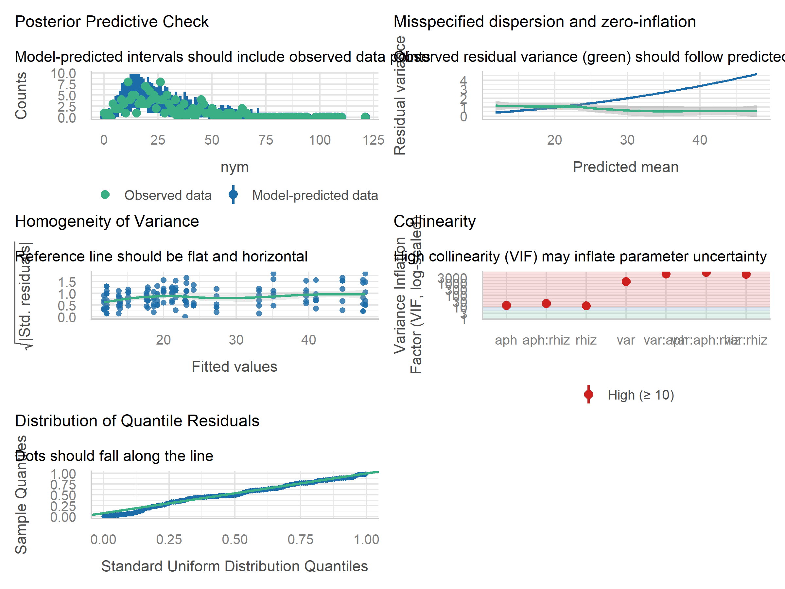<!-- -->

    ## # Overdispersion test
    ## 
    ##  dispersion ratio = 0.760
    ##           p-value = 0.064

### Predicted values from nymph model (glm):

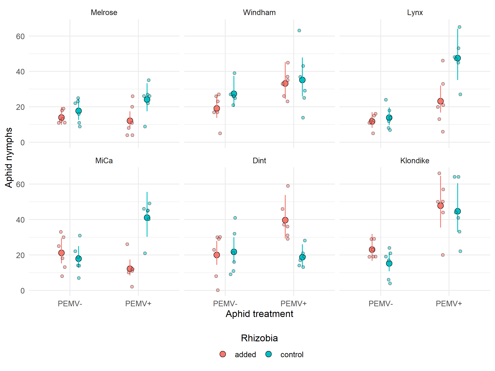<!-- -->

- **Count of aphid nymphs by rhizobia and viral treatment.** Large
  points are model estimated predicted values, whiskers are the 95%
  confidence interval, small points are the raw data.

## Nodules

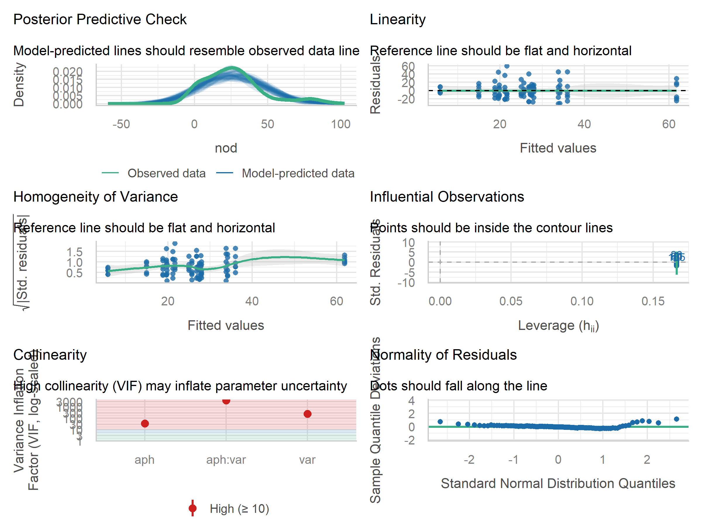<!-- -->

    ## Analysis of Variance Table
    ## 
    ## Response: nod
    ##           Df  Sum Sq Mean Sq F value   Pr(>F)   
    ## aph        2  3300.2 1650.12  4.9173 0.009403 **
    ## var        5  5344.3 1068.85  3.1851 0.010785 * 
    ## aph:var   10  4680.2  468.02  1.3947 0.195556   
    ## Residuals 90 30201.8  335.58                    
    ## ---
    ## Signif. codes:  0 '***' 0.001 '**' 0.01 '*' 0.05 '.' 0.1 ' ' 1
    ## 
    ## Call:
    ## lm(formula = nod ~ aph * var, data = nodb)
    ## 
    ## Residuals:
    ##     Min      1Q  Median      3Q     Max 
    ## -31.833 -10.042  -0.917   8.167  59.333 
    ## 
    ## Coefficients:
    ##                      Estimate Std. Error t value Pr(>|t|)    
    ## (Intercept)            25.667      7.479   3.432 0.000907 ***
    ## aphPEMV-                1.500     10.576   0.142 0.887534    
    ## aphPEMV+                2.167     10.576   0.205 0.838144    
    ## varWindham             10.333     10.576   0.977 0.331176    
    ## varLynx               -19.833     10.576  -1.875 0.064000 .  
    ## varMiCa                -5.833     10.576  -0.552 0.582626    
    ## varDint                -4.000     10.576  -0.378 0.706170    
    ## varKlondike           -10.667     10.576  -1.009 0.315898    
    ## aphPEMV-:varWindham   -16.333     14.957  -1.092 0.277745    
    ## aphPEMV+:varWindham    -4.333     14.957  -0.290 0.772700    
    ## aphPEMV-:varLynx       12.333     14.957   0.825 0.411792    
    ## aphPEMV+:varLynx       20.000     14.957   1.337 0.184543    
    ## aphPEMV-:varMiCa        6.167     14.957   0.412 0.681109    
    ## aphPEMV+:varMiCa        3.000     14.957   0.201 0.841485    
    ## aphPEMV-:varDint       11.000     14.957   0.735 0.463988    
    ## aphPEMV+:varDint       38.000     14.957   2.541 0.012780 *  
    ## aphPEMV-:varKlondike    2.333     14.957   0.156 0.876382    
    ## aphPEMV+:varKlondike    9.667     14.957   0.646 0.519737    
    ## ---
    ## Signif. codes:  0 '***' 0.001 '**' 0.01 '*' 0.05 '.' 0.1 ' ' 1
    ## 
    ## Residual standard error: 18.32 on 90 degrees of freedom
    ## Multiple R-squared:  0.3061, Adjusted R-squared:  0.1751 
    ## F-statistic: 2.336 on 17 and 90 DF,  p-value: 0.005336

- again simple LM diagnostics for the nodule model are fine, but a count
  model would be more appropriate

<!-- -->

    ##  Family: genpois  ( log )
    ## Formula:          nod ~ var * aph
    ## Data: nodb
    ## 
    ##       AIC       BIC    logLik -2*log(L)  df.resid 
    ##     935.1     986.1    -448.6     897.1        89 
    ## 
    ## 
    ## Dispersion parameter for genpois family (): 17.7 
    ## 
    ## Conditional model:
    ##                      Estimate Std. Error z value Pr(>|z|)    
    ## (Intercept)           3.48093    0.24248  14.355  < 2e-16 ***
    ## varWindham            0.13211    0.33100   0.399 0.689796    
    ## varLynx              -1.67614    0.50837  -3.297 0.000977 ***
    ## varMiCa              -0.24664    0.35058  -0.704 0.481735    
    ## varDint              -0.66103    0.39145  -1.689 0.091284 .  
    ## varKlondike          -0.83617    0.42068  -1.988 0.046849 *  
    ## aphPEMV-              0.09003    0.32898   0.274 0.784339    
    ## aphPEMV+             -0.27283    0.38696  -0.705 0.480768    
    ## varWindham:aphPEMV-  -1.30345    0.59150  -2.204 0.027551 *  
    ## varLynx:aphPEMV-      0.68265    0.66270   1.030 0.302964    
    ## varMiCa:aphPEMV-      0.23514    0.47736   0.493 0.622297    
    ## varDint:aphPEMV-      0.58261    0.52018   1.120 0.262706    
    ## varKlondike:aphPEMV-  0.13128    0.58031   0.226 0.821022    
    ## varWindham:aphPEMV+   0.01823    0.52552   0.035 0.972326    
    ## varLynx:aphPEMV+      2.02211    0.63610   3.179 0.001478 ** 
    ## varMiCa:aphPEMV+      0.44451    0.52482   0.847 0.397017    
    ## varDint:aphPEMV+      1.67109    0.52874   3.161 0.001575 ** 
    ## varKlondike:aphPEMV+  0.12499    0.67847   0.184 0.853836    
    ## ---
    ## Signif. codes:  0 '***' 0.001 '**' 0.01 '*' 0.05 '.' 0.1 ' ' 1
    ## # Overdispersion test
    ## 
    ##  dispersion ratio = 0.710
    ##           p-value = 0.272

### Predicted values for nodules (glm):

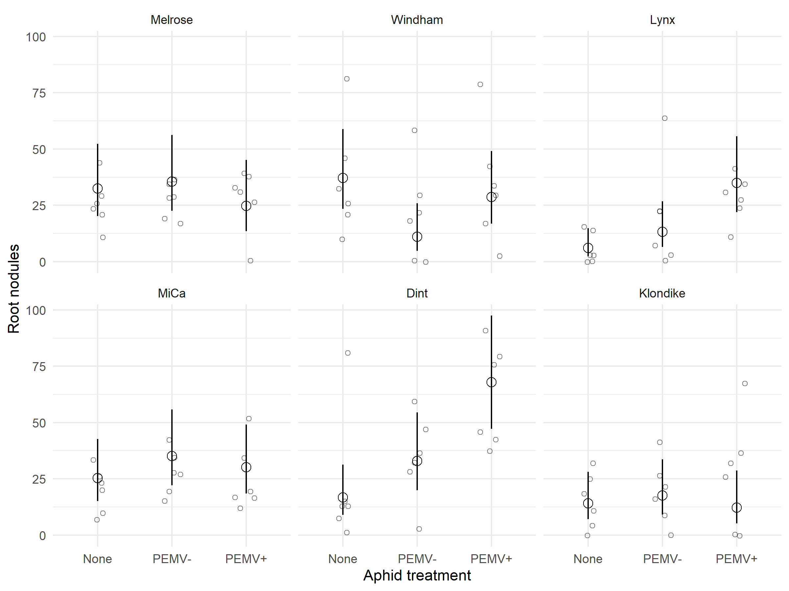<!-- -->

- **Count of nodules by variety and aphid treatment.** Large points are
  model estimated predicted values, whiskers are the 95% confidence
  interval, small points are the raw data.

## Contrasts

### Shoot weight contrasts

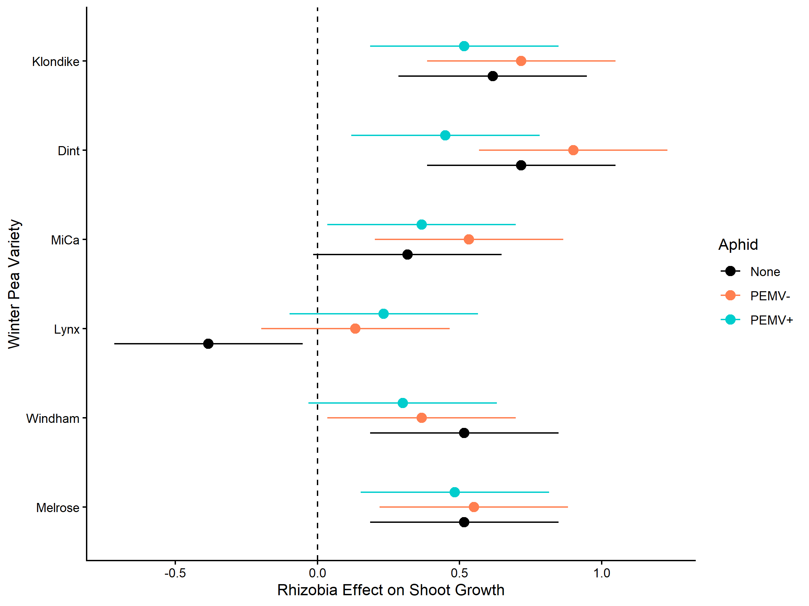<!-- -->

### Root weight contrasts

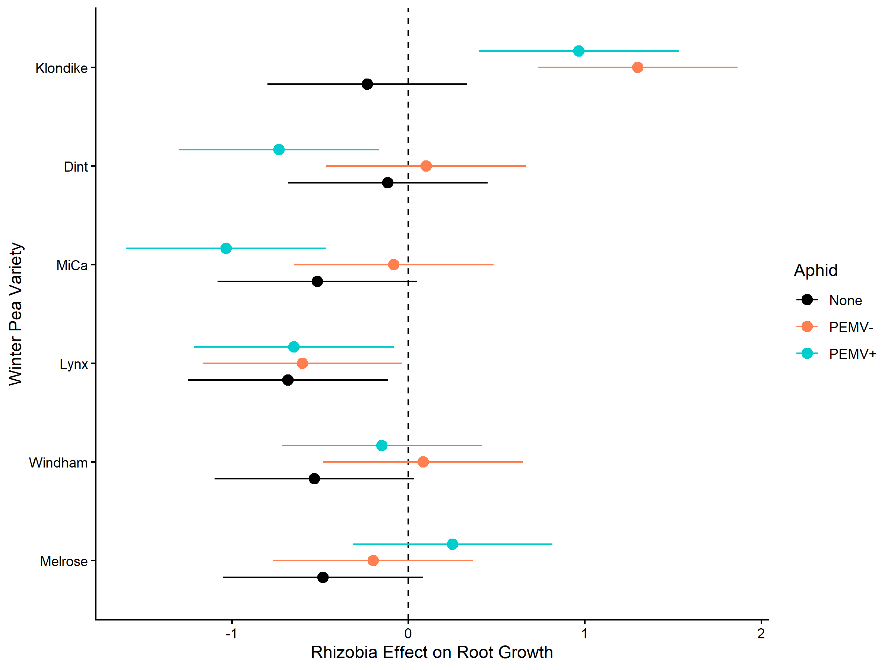<!-- -->

### Nymph contrasts

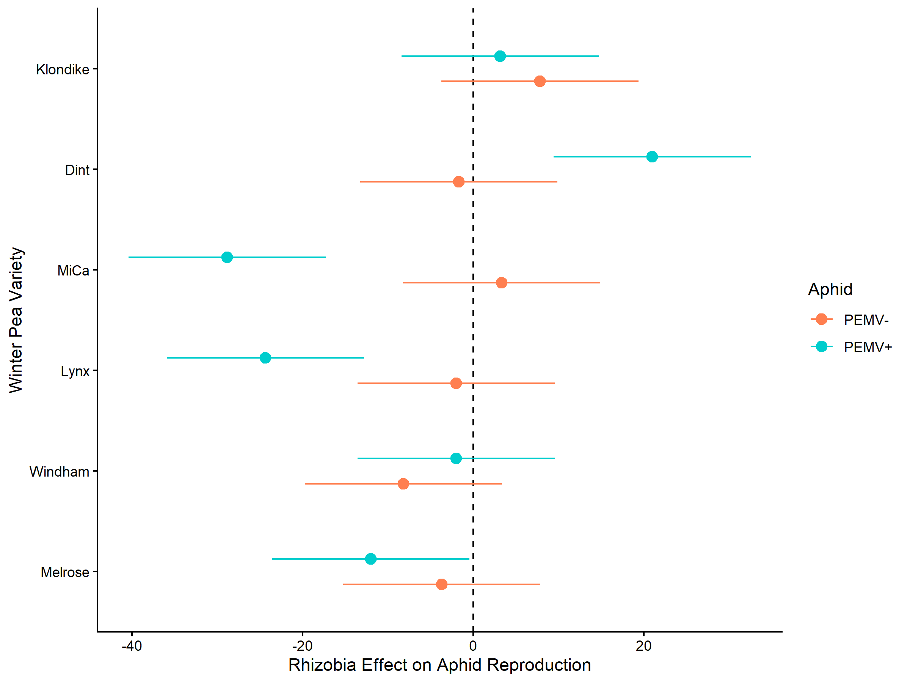<!-- -->

## Session Information

    R version 4.5.2 (2025-10-31 ucrt)
    Platform: x86_64-w64-mingw32/x64
    Running under: Windows 11 x64 (build 26200)

    Matrix products: default
      LAPACK version 3.12.1

    locale:
    [1] LC_COLLATE=English_United States.utf8 
    [2] LC_CTYPE=English_United States.utf8   
    [3] LC_MONETARY=English_United States.utf8
    [4] LC_NUMERIC=C                          
    [5] LC_TIME=English_United States.utf8    

    time zone: America/New_York
    tzcode source: internal

    attached base packages:
    [1] stats     graphics  grDevices utils     datasets  methods   base     

    other attached packages:
     [1] emmeans_2.0.1   car_3.1-5       carData_3.0-6   lubridate_1.9.4
     [5] forcats_1.0.1   stringr_1.6.0   dplyr_1.1.4     purrr_1.2.1    
     [9] readr_2.1.6     tidyr_1.3.2     tibble_3.3.1    ggplot2_4.0.2  
    [13] tidyverse_2.0.0

    loaded via a namespace (and not attached):
     [1] sandwich_3.1-1     generics_0.1.4     stringi_1.8.7      lattice_0.22-7    
     [5] hms_1.1.4          digest_0.6.39      magrittr_2.0.4     evaluate_1.0.5    
     [9] grid_4.5.2         timechange_0.4.0   estimability_1.5.1 RColorBrewer_1.1-3
    [13] mvtnorm_1.3-3      fastmap_1.2.0      Matrix_1.7-4       rprojroot_2.1.1   
    [17] Formula_1.2-5      survival_3.8-3     multcomp_1.4-29    scales_1.4.0      
    [21] TH.data_1.1-5      codetools_0.2-20   abind_1.4-8        cli_3.6.5         
    [25] rlang_1.1.7        splines_4.5.2      withr_3.0.2        yaml_2.3.12       
    [29] otel_0.2.0         tools_4.5.2        tzdb_0.5.0         coda_0.19-4.1     
    [33] vctrs_0.7.1        R6_2.6.1           zoo_1.8-15         lifecycle_1.0.5   
    [37] MASS_7.3-65        pkgconfig_2.0.3    pillar_1.11.1      gtable_0.3.6      
    [41] glue_1.8.0         xfun_0.56          tidyselect_1.2.1   rstudioapi_0.18.0 
    [45] knitr_1.51         xtable_1.8-8       farver_2.1.2       htmltools_0.5.9   
    [49] labeling_0.4.3     rmarkdown_2.30     compiler_4.5.2     S7_0.2.1          
